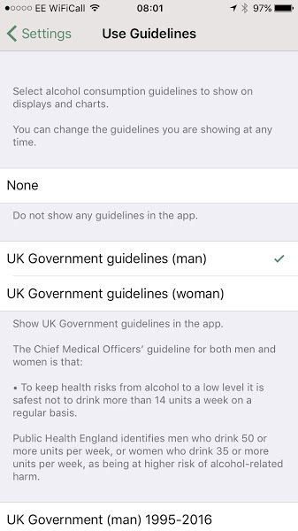

# Drink Tracker

> **You get what you measure!**

Track how much you drink, both day by day and over the weeks and months.

It's easy to enter the exact strength and volume, and to re-use details you've already entered. You can even use a photo to quickly find and enter the same drink again.

If you're following particular consumption guidelines, such as the UK government guidelines, you can display those in the app too, and see at a glance whether you are on track or not.

## Features

Log drinks based on built-in templates, or re-use details you've entered previously

enter the name, strength and volume of your drink, and if you'd like, take a photo to recognise it in the list

view units consumed over the past 7 days

view your week-by-week consumption over the time you've been using the app

select guidelines to check your consumption against, or simply track it

