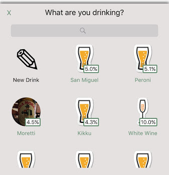
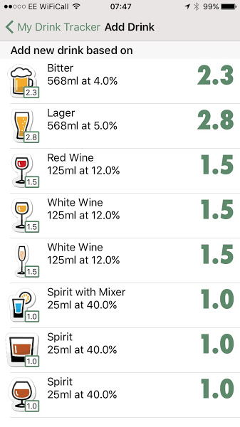

# Drink Tracker

> **You get what you measure!**

Track how much you drink, both day by day and over the weeks and months.

It's easy to enter the exact strength and volume, and to re-use details you've already entered. You can even use a photo to quickly find and enter the same drink again.

If you're following particular consumption guidelines, such as the UK government guidelines, you can display those in the app too, and see at a glance whether you are on track or not.

### Log drinks as you drink them

Record new drinks based on built-in templates. Once you've logged something once, re-use that information with a just couple of taps.

### Give details

Log the exact strength and volume of your drink to get an accurate picture of what you're drinking.

You can also take a photo, to help you recognise it in the list.

### Current week at-a-glance 

Quickly see how much you've drunk this week, compared to guidelines if you're displaying them. You'll also see an estimate
based on what you drank last week.

### History

See how your drinking has changed over time.

### Compare against guidelines

Compare your consumption against different iterations of the UK government guidelines, or just show the numbers.

## Features

- Uses UK units
